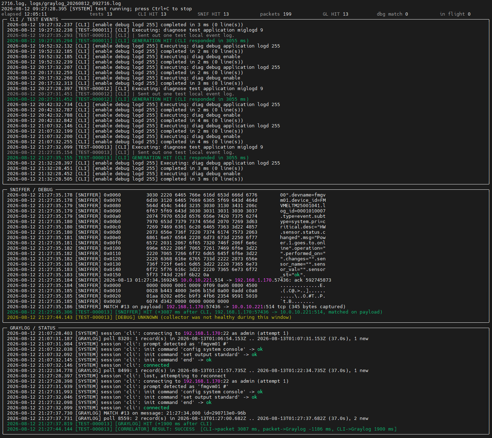

# FortiManager Log Transmission Test

A troubleshooting and correlation tool that answers one question about an
intermittent problem:

> FortiManager says it generated a test event. Did that event actually leave
> FortiManager on the network, and did Graylog subsequently receive it?

The tool drives `diagnose test application miglogd 9` on a repeating interval
and collects evidence independently from four logical sources — **CLI**,
**DEBUG**, **SNIFFER** and **GRAYLOG** — then correlates them per individual
test execution.

**Complete: all four phases.** CLI generation testing, the concurrent packet
sniffer with payload reassembly, the optional logd debug session, Graylog
polling over the Views/Search API, and a correlation engine that matches
evidence per individual test execution — by identity key where the evidence
carries one, by consumable order inside a time window where it does not. Plus
debug mode, the live split-screen display and the reports.

---

## Screenshot


---

## Design principles

These are load-bearing, not decoration:

1. **Collection and correlation are separate.** Collectors only record what
   they observed and when. The correlation engine consumes those observations.
   No correlation logic lives inside the SSH layer.
2. **Every execution of the test command is an independent test event.** There
   is no global "did this message appear at some point" question anywhere in
   the code. Many identical `Power 1 goes to online` events occur during one
   run, so global string matching would be meaningless.
3. **Matched observations are consumable.** Once a sniffer or Graylog record
   has been assigned to `TEST-000001`, it cannot also satisfy `TEST-000002`
   (unless `correlation.allow_reuse` is turned on).
   Where the evidence carries an identity key — a sequence number, a log id —
   matching uses it and stops depending on arrival order entirely. Order is
   the fallback, not the mechanism.
4. **`Sent out one test local event log.` is a claim, not proof.** It only ever
   sets `cli_state = HIT`. The sniffer is the evidence that the event left the
   device; Graylog is the evidence that the destination received it; logd debug
   output is supplemental diagnostics and is never required for success.
5. **`UNKNOWN` is not `MISS`.** A timeout or a dropped session means we did not
   observe the outcome. That is reported distinctly from observing a failure.

---

## Installation

Requires **Python 3.8+** (developed and tested on 3.10).

### Linux / macOS / WSL

```bash
cd /home/mo/ClaudeCodeProjects/loop_ssh
python3 -m venv .venv
source .venv/bin/activate
pip install -r requirements.txt
```

### Windows (PowerShell)

```powershell
cd C:\path\to\loop_ssh
py -3 -m venv .venv
.\.venv\Scripts\Activate.ps1
pip install -r requirements.txt
```

If PowerShell blocks the activation script:

```powershell
Set-ExecutionPolicy -Scope Process -ExecutionPolicy Bypass
```

---

## Credentials

Passwords are read from environment variables, never from the command line, and
are never written to logs, reports or the startup summary. Internally they are
wrapped in a type that renders as `***`, so an accidental log line or traceback
cannot leak them.

### Linux / macOS / WSL

```bash
export FORTIMANAGER_PASSWORD='your-password'
```

### Windows PowerShell

```powershell
$env:FORTIMANAGER_PASSWORD = 'your-password'
```

### Windows cmd.exe

```cmd
set FORTIMANAGER_PASSWORD=your-password
```

If the variable named in `password_env` is missing, startup fails with a message
naming the variable and showing how to set it on each platform. A plaintext
`password:` in `config.yaml` is accepted for lab use but produces a warning.

---

## Running

### Linux / macOS / WSL

```bash
source .venv/bin/activate && export FORTIMANAGER_PASSWORD='your-password' && python main.py --config config.yaml
```

### Windows (PowerShell)

```powershell
.\.venv\Scripts\Activate.ps1; $env:FORTIMANAGER_PASSWORD = 'your-password'; python main.py --config config.yaml
```

The tool prints a summary, asks `Start test? [y/N]`, then runs until **Ctrl+C**.

### Useful options

| Option | Effect |
|---|---|
| `-c, --config PATH` | Configuration file (default `config.yaml`) |
| `-y, --yes` | Skip the confirmation prompt (required when stdin is not a terminal) |
| `-d, --duration SECONDS` | Stop automatically after N seconds |
| `--check-config` | Validate the config, print the summary, exit without connecting |
| `--log-dir PATH` | Override `logging.directory` |
| `--log-mode combined\|separate` | Override `logging.mode` |
| `--console plain\|rich\|none` | Override `logging.console`; `rich` is the live split-screen display |
| `--plain` | Force plain line output even if `logging.console` is `rich` |
| `--no-sniffer` | Disable the packet sniffer for this run |
| `--no-debug` | Disable the logd debug session for this run |
| `--debug-mode` | Capture all raw evidence + why every candidate did or did not match |
| `--diagnostics-dir PATH` | Where debug-mode artefacts go (default `<log dir>/diagnostics`) |
| `--shutdown-grace SECONDS` | How long in-flight commands may finish on Ctrl+C (default 5) |
| `--include-raw-evidence` | Put full raw device output in the JSON report |
| `--mock` | Run against an in-process fake FortiManager; contacts no device |
| `--mock-fail-rate RATE` | Fraction of mock test commands that report failure |
| `--mock-hang-rate RATE` | Fraction of mock test commands that never respond |
| `--mock-drop-rate RATE` | Fraction of mock events generated but never transmitted |
| `--mock-headers-only` | Mock sniffer prints headers with no payload (reproduces low verbosity) |
| `--mock-seed N` | Seed for reproducible mock failure injection |

Exit codes: `0` normal, `1` unexpected error, `2` configuration or connection
failure, `130` interrupted before startup finished.

---

## Configuration

Everything device-specific and test-specific lives in `config.yaml`. No IP
address, credential, command, expected message, interval, Graylog filter or
correlation parameter is hardcoded. The shipped `config.yaml` is heavily
commented; the key sections:

### `fortimanager`

Connection details plus SSH behaviour. Notable keys:

- `session_init_commands` — run on every new session. The default turns CLI
  paging off, which matters because a `--More--` pager chops long output.
- `prompt_pattern` — **fallback only.** The tool learns the real prompt by
  pressing Enter after login, which handles `FMGVM01 #` and
  `FMGVM01 (global) #` without configuration.
- `kex_algs` / `encryption_algs` / `server_host_key_algs` — uncomment if
  asyncssh reports *"no matching ... algorithm found"* against an older build.
- `reconnect` — exponential backoff policy. `max_attempts: 0` retries forever.

### `command_groups`

An arbitrary number of groups, each with a name, one or more commands and an
interval. **Each group runs as its own asyncio task at its own interval**; a
slow group cannot delay a fast one.

Exactly one group should set `test_event: true`. Each execution of that group's
test command (selected by `test_command_index`, default the first command)
becomes an independent `TEST-nnnnnn` event. Other commands in the same group
run as context. As an alternative, `correlation.test_group` can name the group.

If a run takes longer than its interval, the missed slots are **skipped** with a
warning rather than allowed to pile up on the device.

### `correlation`

`cli_success_pattern`, `expected_message`, `sniffer_match_pattern`,
`graylog_match_pattern`, the `timeout_seconds` window, the
`timestamp_tolerance_seconds` clock-skew allowance, and `allow_reuse`. Set
`pattern_is_regex: true` to treat the patterns as regular expressions instead of
case-insensitive substrings.

`bound_window_by_next_event` (default `true`) stops a test event claiming
evidence that appeared after the *next* test command was issued, even if its own
window is still open. Without it an earlier event greedily consumes the later
event's evidence and the later one is wrongly reported as a MISS. Turn it off
only if your end-to-end latency genuinely exceeds the test interval.

### `sniffer`

The **complete** FortiManager sniffer command is supplied here. The tool never
constructs it:

```yaml
sniffer:
  enabled: true
  command: |
    diagnose sniffer packet any 'host 10.0.10.221' 6 0 a
```

Other keys: `block_idle_seconds` (how much silence ends a packet block),
`echo_to_log` (mirror raw capture into the log and the SNIFFER pane),
`decode_hex_payload`, `stop_key`, `session_name`.

**How matching actually works** — this is the part that matters. FortiManager
prints a packet as a header line plus a hex/ASCII dump, so the expected message
is normally split across several lines and truncated in the ASCII column:

```
2026-08-11 15:32:01.224661 port1 out 10.0.10.10.514 -> 10.0.10.221.514: udp 96
0x0020   3e64 6174 653d 3230 3236 2d30 382d 3131   >date=2026-08-11
0x0030   206d 7367 3d22 506f 7765 7220 3120 676f    msg="Power 1 go
0x0040   6573 2074 6f20 6f6e 6c69 6e65 2200 0000   es to online"...
```

No single printed line contains `Power 1 goes to online`. The tool therefore
buffers each packet block, rebuilds the packet bytes from the hex columns by
offset, and searches three surfaces in order of reliability:

1. the reassembled payload bytes (handles any split, any verbosity)
2. the concatenated ASCII columns (handles a truncated hex column)
3. the raw block text (handles low verbosity that prints text directly)

Which surface matched is recorded per observation as `matched_on` and appears in
the log line and the JSON report.

A packet block ends at the next header line or after `block_idle_seconds` of
silence. The observation timestamp is the **local** time the block completed,
not the device's timestamp — the device clock is not assumed to agree with this
computer's. The device timestamp is preserved in `fields.device_timestamp`.

### `debug`

`setup_commands` and `cleanup_commands` for the optional logd session. Cleanup
is mandatory when debug is enabled, so device debugging is always turned off
again at shutdown — including after Ctrl+C or a crash. If cleanup cannot be
completed the log says `CHECK THE DEVICE: debugging may still be enabled`.

Debug evidence is **supplemental**: it is tracked in its own queue, reported
separately, and never contributes to the transmission verdict. A test can
succeed with no debug evidence at all.

### `graylog`

Targets the Graylog **Views/Search API** (`POST /api/views/search` then
`/execute`). Every key under `filters` becomes a `field:"value"` term ANDed into
the generated query — adding a new filtering field needs no code change:

```yaml
graylog:
  filters:
    source: "fmgvm01"
    facility: "local7"
    device_id: "FMVMELTM25001041"    # a list value becomes an OR group
```

Authentication is an API token (`api_token_env`, sent as `<token>:token`) or
`username` + `password_env`. Values are Lucene-escaped; `query_extra` appends
raw Lucene for anything filters cannot express; `streams` restricts the search
to specific stream IDs.

Four behaviours worth knowing:

- **The search window starts at the authoritative test-start timestamp** and
  never reaches earlier, so historical copies of the expected message can never
  be correlated with this run.
- **Polls overlap** by `poll_overlap_seconds` so a record indexed just as a
  window closed is not lost, and records are **deduplicated by message id**.
- **Message content is verified locally by default**
  (`include_message_in_query: false`). The query narrows by filters; the tool
  then checks the message text itself. That is slower on a high-volume source
  but it means a failure shows you the near misses in debug mode instead of an
  empty result set.
- **Correlation uses the message timestamp converted to local time**, not the
  poll time, so deltas are not quantised to the poll interval. The lag between
  each message's timestamp and its retrieval is tracked across the run, and a
  clock offset large enough to break correlation is reported explicitly:

```
CLOCK WARNING: Graylog message timestamps run 14.2s AHEAD of this computer's
clock, which is more than correlation.timestamp_tolerance_seconds (2s).
Matching records will fall outside every correlation window.
```

If Graylog cannot be reached, or a poll fails, affected events resolve
`UNKNOWN` rather than `MISS` — delivery was not observed either way.

**TLS**: a self-signed Graylog certificate fails verification with a message
naming the fix. Point `ca_bundle` at your internal CA, or set
`verify_tls: false` for a lab.

### `logging`

`mode: combined` writes one file with `[CLI]` / `[SNIFFER]` / `[GRAYLOG]` /
`[CORRELATOR]` / `[DEBUG]` / `[SYSTEM]` labels.
`mode: separate` writes one file per source. Either way, the structured reports
are produced as well.

---

## Output

### Live console (tee)

Every line shown is written to disk at the same time, with a millisecond
timestamp, a source label and an event ID where applicable:

```
2026-08-11 15:32:01.125 [TEST-000001] [CLI] Executing: diagnose test application miglogd 9
2026-08-11 15:32:01.201 [TEST-000001] [CLI] | Sent out one test local event log.
2026-08-11 15:32:01.201 [TEST-000001] [CLI] GENERATION HIT (CLI responded in 76 ms)
2026-08-11 15:32:01.201 [TEST-000001] [CORRELATOR] RESULT: SUCCESS
```

Lines prefixed `|` are verbatim device output. Log writes are flushed per line,
so an abrupt exit never loses the tail.

### Live split-screen display

With `logging.console: rich` (or `--console rich`) the same lines are routed
into three panes with a statistics header:

```
elapsed 00:00:28   tests 3   CLI HIT 3   SNIF HIT 3   packets 3   dbg match 3   in flight 0
╭─ CLI / TEST EVENTS ──────────────────────────────────────────────────────────╮
│ 2026-08-11 17:32:40.514 [TEST-000001] [CLI] GENERATION HIT (105 ms)          │
╰──────────────────────────────────────────────────────────────────────────────╯
╭─ SNIFFER / DEBUG ────────────────────────────────────────────────────────────╮
│ 2026-08-11 17:32:50.867 [SNIFFER] MATCH #3 on payload: 10.0.10.10:514 -> …   │
╰──────────────────────────────────────────────────────────────────────────────╯
╭─ GRAYLOG / STATUS ───────────────────────────────────────────────────────────╮
│ 2026-08-11 17:32:57.433 [TEST-000002] [CORRELATOR] RESULT: SUCCESS           │
╰──────────────────────────────────────────────────────────────────────────────╯
```

The display is only a presentation layer over the same log records, so it
changes nothing about what is collected or written to disk. It degrades to
plain output automatically when stdout is not a terminal, when `rich` is not
installed, or if any render call fails — the test is never put at risk by the
UI. The final summary always prints as ordinary scrollable output after the
live view is torn down.

### How a packet gets attributed to one test event

Per the design principles, matching is ordered and consumable, never global:

1. The correlator walks open test events in creation order, oldest first.
2. Each event claims the oldest **unclaimed** observation whose timestamp falls
   in `[cli_start - tolerance, cli_start + timeout]`, further capped at the next
   test command's start time.
3. A claimed observation is stamped with that event ID and can never satisfy
   another event.
4. When an event's window expires it is closed and classified. A source whose
   collector was unhealthy yields `UNKNOWN`, not `MISS`.

The consequence worth internalising: if FortiManager emits ten identical
`Power 1 goes to online` events and only seven packets leave the box, you get
seven `success` and three `generated_not_transmitted` — not "the message was
seen, so everything is fine".

### Files

In `logging.directory` (default `./logs`), stamped with the run start time:

| File | Contents |
|---|---|
| `fortimanager_test_<ts>.log` | Combined log (combined mode) |
| `fortimanager_cli_<ts>.log`, `..._sniffer_<ts>.log`, `..._debug_<ts>.log`, `graylog_<ts>.log`, `correlation_<ts>.log` | Per-source logs (separate mode) |
| `summary_<ts>.txt` | Human-readable final summary |
| `detail_<ts>.txt` | Per-event breakdown: states, timestamps, deltas, identity, result |
| `events_<ts>.json` | Run metadata, aggregate statistics, one record per test event |
| `events_<ts>.csv` | The same per-event records, spreadsheet-friendly |

`detail_<ts>.txt` is one block per execution:

```
TEST-000004

  CLI execution:        HIT
  Event generated:      HIT
  Debug evidence:       HIT  (1 line(s))
  Packet observed:      HIT
  Graylog received:     HIT

  CLI timestamp:        23:31:24.535
  Sniffer timestamp:    23:31:24.642
  Graylog timestamp:    23:31:24.646

  CLI -> packet:        107 ms
  Packet -> Graylog:    3 ms
  CLI -> Graylog:       110 ms

  Identity:             device_id=FMVMELTM25001041 log_id=0100032003 seq=4

  RESULT: SUCCESS
```

The summary adds a failure-pattern section, which matters for an intermittent
fault — random one-in-twenty and "fine for ten minutes then eight in a row" are
different problems:

```
Failure pattern:
  longest run of consecutive successes: 42
  longest run of consecutive failures:  6
  first failure: TEST-000037 at 15:34:12.101
  last failure:  TEST-000184 at 15:52:44.902

  Run timeline (left = start, right = end):
    [.....o....X.........oo........]
    . all passed   o some failed   X all failed
```

A JSON event record looks like:

```json
{
  "event_id": "TEST-000037",
  "cli_start": "2026-08-11T15:32:01.125",
  "cli_state": "HIT",
  "cli_generated": true,
  "sniffer_state": "MISS",
  "sniffer_seen": false,
  "graylog_state": "MISS",
  "graylog_seen": false,
  "cli_response_ms": 76.4,
  "result": "generated_not_transmitted",
  "result_description": "EVENT GENERATED BY FORTIMANAGER BUT NO MATCHING OUTBOUND PACKET OBSERVED"
}
```

### Result classifications

| `result` | Meaning |
|---|---|
| `success` | Every enabled source produced a hit |
| `not_generated` | FortiManager did not report generating the event |
| `generation_unknown` | No usable CLI response (timeout, dropped session) |
| `generated_not_transmitted` | Generated, but no matching outbound packet observed |
| `transmitted_not_in_graylog` | Packet observed, but Graylog has no matching event |
| `in_graylog_without_packet` | Graylog has the event but the sniffer did not see it — classified separately rather than assuming either source is wrong |
| `inconclusive` | Combination of states that does not map to the above |

---

## Debug mode: why didn't it match?

When a run is full of MISSes, the first question is whether the event really
was not transmitted, or whether the tool could not see it. A plain `MISS` does
not distinguish those. `--debug-mode` does:

```bash
python main.py --config config.yaml --debug-mode
```

It writes to `<log dir>/diagnostics/`:

| File | Contents |
|---|---|
| `raw_cli_<ts>.log` | Every byte received on the CLI session, verbatim |
| `raw_sniffer_<ts>.log` | Every byte received on the sniffer session, verbatim |
| `raw_debug_<ts>.log` | Every byte received on the debug session, verbatim |
| `raw_graylog_<ts>.jsonl` | Every Graylog API exchange *(Phase 3)* |
| `comparison_<ts>.txt` | Per test event: all sources side by side, with reasons |
| `comparison_<ts>.json` | The same, machine readable |

The raw files are unparsed and unfiltered — they are what the device actually
sent, with a local receive timestamp per line. When the tool and the device
disagree, these settle it.

### The comparison report

One block per test event. Every candidate the collectors examined inside the
window is listed, matching or not, with the reason:

```
==============================================================================
TEST-000002
==============================================================================

CLI                                                          RESULT: HIT
  command        : diagnose test application miglogd 9
  sent at        : 18:01:36.781
  responded at   : 18:01:36.883  (+103 ms)
  looking for    : 'Sent out one test local event log'
  device said    :
    | Sent out one test local event log.

CORRELATION WINDOW: 18:01:34.781 .. 18:01:46.781

SNIFFER                                                      RESULT: MISS
  why            : 1 candidate(s) were examined inside the window and none
                   matched; 1 of them for the same reason (no_payload_captured)
    The capture contained packet headers but no packet data, so the expected
    message could not be searched for at all. Raise the sniffer verbosity
    until the output includes 0x0000-style hex dump lines.
  candidates in window: 1  (+2 outside)
   [1] 18:01:37.234 (+0.453s)  no match
        192.168.1.170:44500 -> 10.0.10.221:514 tcp (0 bytes captured)
        reason: no_payload_captured
        | 2026-08-11 18:01:36.883269 192.168.1.170.44500 -> ...: psh 1447941743

DEBUG                                                        RESULT: HIT
  matched at     : 18:01:36.883  (+103 ms after CLI)

GRAYLOG                                                      RESULT: NOT_ENABLED

VERDICT: EVENT GENERATED BY FORTIMANAGER BUT NO MATCHING OUTBOUND PACKET OBSERVED
```

### Reason codes

| Code | Meaning |
|---|---|
| `matched` | Found; the report names which search surface matched |
| `no_payload_captured` | Headers only, no packet data — nothing could be searched |
| `pattern_absent` | Content was captured and searched; the message is not in it |
| `payload_not_text` | Data captured but not readable text |
| `payload_looks_encrypted` | Payload begins with a TLS record — plaintext matching cannot work |
| `matches_exist_but_outside_window` | Evidence found, but outside this event's window (clock skew?) |
| `matches_in_window_already_claimed_by_another_event` | An earlier event consumed it |
| `no_matching_observations_at_all` | This collector never matched anything all run |
| `collector_not_running` | Reported `UNKNOWN`, not `MISS` — absence proves nothing |

### Identity-based correlation

Matching by arrival order is fragile when latency varies: if Graylog indexes
event 3 before event 1, order-based matching attributes both wrongly.
`correlation.identity` fixes that by extracting keys from the evidence itself:

```yaml
correlation:
  identity:
    enabled: true
    require: false
    # Defaults when `fields` is omitted: seq, log_id, device_id,
    # device_name, event_time
```

When the sniffer claims a packet carrying `seq=4`, the event learns
`seq=4`, and the Graylog record claimed for it must agree:

```
[TEST-000004] [GRAYLOG] HIT (+103 ms after CLI, matched by identity
              device_id=FMVMELTM25001041 log_id=0100032003 seq=4)
```

Three properties worth knowing:

- **A pattern that finds nothing costs nothing.** No key means no constraint,
  and matching falls back to order and time window exactly as before.
- **Disagreement is evidence; absence is not.** Evidence whose shared keys
  *conflict* with the event is never claimed, even in the fallback pass. No
  shared key at all just means identity cannot decide.
- **The CLI cannot participate.** FortiManager's reply to
  `diagnose test application miglogd 9` carries no identifier, so identity
  links the sniffer and Graylog evidence to each other; the CLI is still tied
  to them by the time window.

`require: true` makes identity mandatory — unambiguous, but anything the
patterns cannot read becomes a MISS.

### Packet-flow constraints

A packet carrying the expected message but going somewhere else is not the
event under test:

```yaml
correlation:
  sniffer_flow:
    dst_ip: "10.0.10.221"
    dst_port: 514
```

Rejected packets appear in debug mode with reason `flow_mismatch`. A field the
sniffer could not parse is never treated as a mismatch — that would turn a
parsing gap into a false claim about transmission.

### The FINDINGS section

At the end of the report, sources that matched *sometimes* are reported as
working, and sources that **never** matched are called out with their dominant
reason — primary evidence first:

```
FINDINGS

  SNIFFER (PRIMARY EVIDENCE OF TRANSMISSION): examined 42 candidate(s), NONE matched.
    dominant reason: no_payload_captured (42 of 42)
      The capture contained packet headers but no packet data ...
      Until this is resolved, every SNIFFER MISS in this run is
      INCONCLUSIVE: it does not show that FortiManager failed to
      transmit.

  DEBUG: 18 of 54 candidate(s) matched - this collector is working.
```

That distinction is the whole point: a sniffer that cannot see payload produces
MISSes that say nothing about whether FortiManager transmitted.

### Reproducing a broken capture offline

```bash
python main.py --mock --mock-headers-only --yes --duration 22 --debug-mode
```

The mock sniffer then prints headers with no payload, exactly like a
too-low verbosity, so you can see what the report looks like when the capture
itself is the problem.

---

## Ctrl+C behaviour

Ctrl+C runs an ordered shutdown and produces **no traceback**:

1. Stop creating new test events
2. Allow in-flight commands to finish or expire (`--shutdown-grace`, default 5 s)
3. Stop the command loops, then let test events still inside their correlation
   window finish — the sniffer keeps capturing during this drain, so a packet
   still in the air is claimed rather than written off as a MISS
4. Stop the sniffer
5. Disable FortiManager debug if enabled
6. Stop Graylog polling *(Phase 3)*
7. Flush all logs
8. Close SSH connections
9. Generate reports
10. Print the final summary

A second Ctrl+C exits immediately.

---

## Testing this phase

`--mock` runs the entire pipeline against an in-process fake FortiManager. No
device is contacted and no network traffic is generated, so all of the following
are safe to run anywhere. The mock still reads `FORTIMANAGER_PASSWORD`, so set
it to any value.

```bash
export FORTIMANAGER_PASSWORD=dummy
```

**1. Validate the configuration without connecting**

```bash
python main.py --check-config
```

Expect the startup summary and `Configuration is valid.` Then unset
`FORTIMANAGER_PASSWORD` and re-run: it must fail with a message naming the
variable and must not print any credential.

**2. Offline end-to-end run**

```bash
python main.py --mock --yes --duration 20
```

Expect roughly four `TEST-00000n` events at the 5 s interval, each showing
`Executing:` → device output → `GENERATION HIT` → `RESULT: SUCCESS`, then a
summary reporting 4 executions, `CLI HIT: 4`, `Success rate: 100.00%`, and the
paths of the log and the three report files.

**3. Failure classification**

```bash
python main.py --mock --mock-fail-rate 0.5 --mock-seed 7 --yes --duration 16
```

Expect a mixture of `GENERATION MISS (device reported failure: 'Command fail')`
and hits, a reduced success rate, and the failed event IDs listed at the end of
the summary.

**4. The UNKNOWN path**

```bash
python main.py --mock --mock-hang-rate 1.0 --yes --duration 20
```

Expect `GENERATION UNKNOWN (timeout ...)` for every event — distinct from MISS,
because a hang means the outcome was never observed.

**5. Ctrl+C**

```bash
python main.py --mock --yes
```

Press Ctrl+C after a few events. Expect the ordered shutdown messages, a
complete summary, report files, and **no traceback**.

**6. Separate log mode**

```bash
python main.py --mock --yes --duration 12 --log-mode separate
```

Expect `fortimanager_cli_<ts>.log`, `fortimanager_sniffer_<ts>.log`,
`fortimanager_debug_<ts>.log`, `correlation_<ts>.log` and
`fortimanager_system_<ts>.log`, plus the reports.

**7. Sniffer payload reassembly**

With `sniffer.enabled: true` the mock emits a realistic FortiOS hex dump in
which the expected message straddles two dump lines. Expect
`[SNIFFER] MATCH #n on payload: 10.0.10.10:514 -> 10.0.10.221:514 udp ...`
followed by `[TEST-00000n] [SNIFFER] HIT (+453 ms after CLI, ...)`. The
`on payload` part confirms the reassembled-bytes surface matched, not a lucky
single-line hit.

**8. The fault you are actually hunting — generated but not transmitted**

```bash
python main.py --mock --mock-drop-rate 0.5 --mock-seed 3 --yes --duration 33
```

The mock reports `Sent out one test local event log.` and emits debug lines, but
sends no packet for the dropped events. Expect those events to classify as
`EVENT GENERATED BY FORTIMANAGER BUT NO MATCHING OUTBOUND PACKET OBSERVED`, with
`Debug evidence HIT` higher than `Sniffer HIT` in the summary — a direct
demonstration that debug output is not proof of transmission.

Check also that a dropped event does **not** steal a later event's packet: each
`SNIFFER HIT` should show a delta of a few hundred milliseconds, never several
seconds.

**9. Live split-screen display**

```bash
python main.py --mock --yes --duration 20 --console rich
```

Expect three panes with a live statistics header, then the normal summary after
the display closes. Piping the same command to a file must fall back to plain
line output instead of emitting escape codes.

**10. Ctrl+C with collectors running**

Start with the sniffer and debug enabled, press Ctrl+C mid-run, and confirm the
log shows `stopping sniffer`, then `cleanup: diagnose debug disable` and
`cleanup: diagnose debug reset`, then session close and the summary — with no
traceback. Device-side debugging must never be left on.

**11. Graylog end to end**

The repo ships no Graylog, but the whole chain can be exercised against a real
HTTP server. With a Graylog reachable, the four outcomes to confirm are:

| Scenario | Expected `result` |
|---|---|
| Everything works | `success` |
| Packet seen, never indexed | `transmitted_not_in_graylog` |
| Indexed, no readable packet | `in_graylog_without_packet` |
| Graylog down or a poll fails | `generation_unknown` / `inconclusive`, never a false `MISS` |

Confirm too that records predating the run are ignored: index a matching
message, then start a test. It must not be claimed by any event.

### Against the real device

```bash
python main.py --config config.yaml --duration 60
```

Watch the startup lines for `prompt detected as '...'` and for each
`session '<name>': init command ... -> ok`, for all three sessions (`cli`,
`sniffer`, `debug`). If the prompt is not detected, or the init commands report
timeouts, adjust `prompt_pattern` and `session_init_commands` before running a
long test.

If the device refuses the second or third login you will see:

```
session 'sniffer': connect failed (the device closed the session during login.
FortiManager limits concurrent admin logins, ...)
```

The test still runs, and the sniffer state is reported `UNKNOWN` rather than
`MISS`. To proceed either drop a collector (`--no-debug`) or use a second admin
account.

---

## Assumptions and FortiManager-specific limitations

- **Interactive shell only.** FortiManager has no usable non-interactive `exec`
  channel, so every command goes through an interactive shell with prompt
  detection. Prompt learning covers the common `FMGVM01 #` and
  `FMGVM01 (global) #` forms; unusual prompts need `prompt_pattern`.
- **CLI paging.** A `--More--` pager corrupts long output. The default
  `session_init_commands` disable paging, and the reader also answers pagers
  automatically as a backstop, but the exact paging commands vary between
  FortiManager builds and may need adjusting.
- **Concurrent admin sessions.** All command groups share one CLI session
  (serialised by a lock); the sniffer and debug collectors each open their own.
  That is up to three simultaneous logins for the same account. FortiManager
  restricts concurrent admin logins, and if it refuses, the affected collector
  reports `UNKNOWN` and the test continues. The fix is `--no-debug`, or a second
  admin account.
- **Sniffer verbosity.** The parser needs verbosity `3` (headers plus hex/ASCII
  payload) to reassemble packets. Lower verbosities still work through the raw
  text surface, but a message split across printed lines will be missed. Do not
  lower it below `3` without setting `decode_hex_payload: false` and accepting
  reduced reliability.
- **Sniffer capture scope.** The sniffer sees what the configured filter sees.
  If the filter is wrong, packets are missed and the tool honestly reports
  `MISS` — a `MISS` means "no matching packet was captured", which is only
  evidence of non-transmission if the filter is right. Verify the filter against
  a known-good event before trusting a run of misses.
- **Debug output cost.** `diagnose debug application logd 255` is verbose and
  adds load on a busy FortiManager. It is diagnostic only; leave it off for long
  soak tests.
- **Correlation is order-based.** Matching uses arrival order, the time window
  and consumption, not a per-event identifier — FortiManager's test event does
  not carry one. If the real end-to-end latency exceeds the test interval,
  attribution can shift by one event; raise `interval_seconds` or turn off
  `bound_window_by_next_event` if you see that.
- **One connection per logical session.** Sessions do not share channels on one
  TCP connection: FortiOS/FortiManager is unreliable about multiplexing, and
  separate connections give real fault isolation, so a dropped sniffer session
  cannot take the CLI loop down with it.
- **Interval accuracy is best-effort.** Scheduling is drift-free (each run is
  scheduled from the previous slot, not from when the last one finished), but a
  run that overruns its interval causes the missed slots to be skipped.
- **Clocks.** FortiManager, this computer and Graylog are not assumed to agree.
  Correlation uses windows and `timestamp_tolerance_seconds`, never exact
  timestamp equality.
- **Legacy SSH algorithms.** Older FortiManager builds may not negotiate with a
  modern asyncssh default algorithm set. The `kex_algs`, `encryption_algs` and
  `server_host_key_algs` config keys exist for that case.

---

## Phase status

| Phase | Scope | Status |
|---|---|---|
| **1** | Config parsing and validation, asyncssh connection, repeating command groups, test event IDs, CLI generation detection, tee logging, startup confirmation, Ctrl+C handling, summary and reports | **Complete** |
| **2** | Dedicated concurrent sniffer session, packet block buffering and hex/ASCII payload reassembly, expected-message detection across multi-line packet output, observation queue consumption, optional logd debug session, live split-screen display, combined/separate log modes | **Complete** |
| **3** | Graylog Views/Search API client, token and password authentication, dynamic filter-driven query building, search window anchored at test start, continuous polling with overlap and dedup, Graylog observation queue, clock-skew detection | **Complete** |
| **4** | Identity-based correlation on secondary fields, optional packet-flow constraints, per-event detail report, percentiles, failure streaks and run timeline | **Complete** |

All four evidence sources are live and correlated.

---

## Project layout

```
main.py                  CLI entry point: argparse, confirmation, asyncio.run
config.yaml              All device-specific and test-specific settings
requirements.txt
fmtest/
  config.py              YAML -> dataclasses, validation, credential resolution
  logbus.py              Tee logging: console sink + combined/separate file sinks
  events.py              Source/MatchState enums, TestEvent, Observation, EventTracker
  ssh_manager.py         asyncssh lifecycle, retry/backoff, clean teardown
  shell.py               Interactive shell: prompt learning, send/read-to-prompt
  command_runner.py      Shared session, one asyncio task per command group
  cli_probe.py           Test command execution -> TestEvent CLI state
  sniffer.py             Packet block parsing, payload reassembly, match recording
  debug_session.py       logd stream capture and guaranteed device cleanup
  correlator.py          Claims observations for individual test events
  ui.py                  Rich live split-screen display (a ConsoleSink)
  reporting.py           Summary text, JSON and CSV reports
  app.py                 Orchestration: banner, supervision, ordered shutdown
  mock_device.py         In-process fake FortiManager for --mock
```

`events.py` defines the complete data model — including the Graylog fields and
observation queue that Phase 3 will populate. That is the seam that lets each
phase attach as an additional observation producer without restructuring
anything: Phase 2 added `sniffer.py` and `debug_session.py` as producers and
`correlator.py` as the consumer, and changed nothing in `ssh_manager.py`,
`command_runner.py` or `cli_probe.py`.
